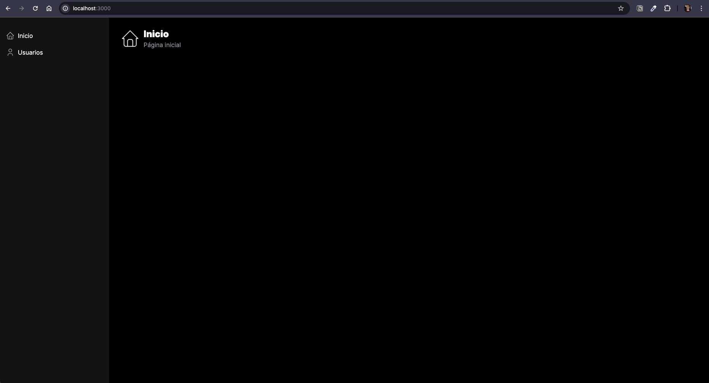
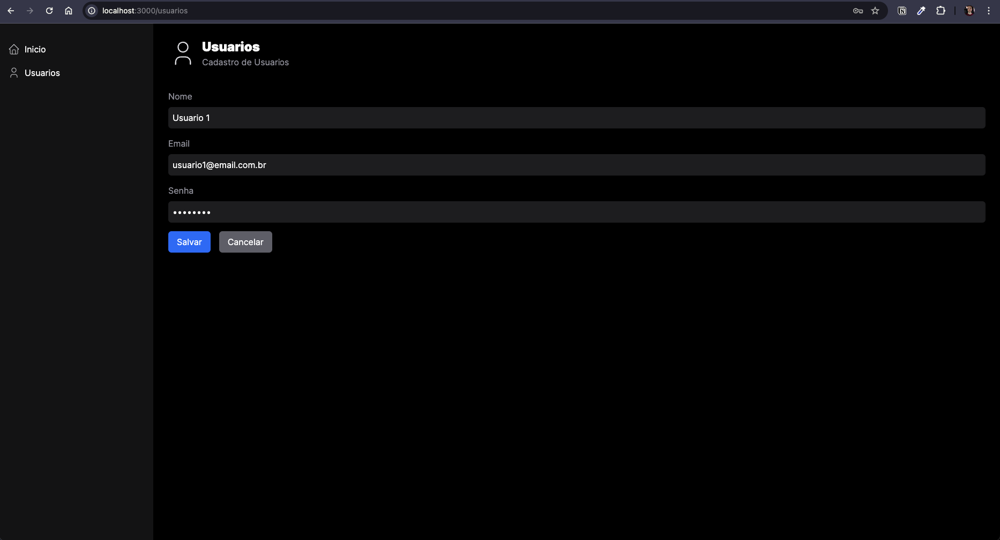
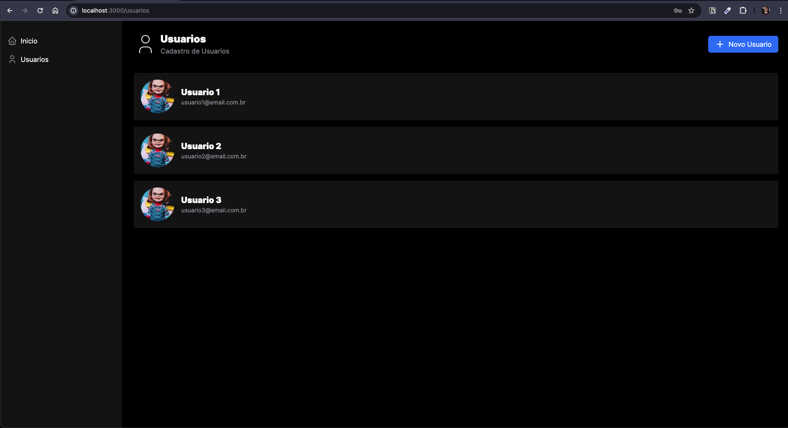
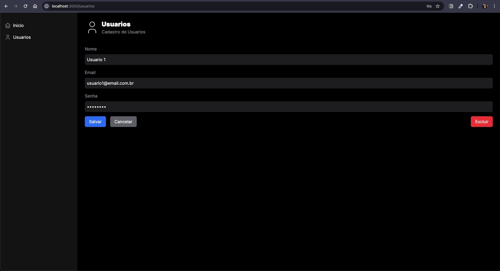

# APP BD

Aplicação para gerenciamento de usuários, criada na video aula da cod3r, disponibilizada no link [Sua Primeira Aplicação Full Stack com Banco de Dados e Next.JS 14](https://youtu.be/mikoTbhH_Qg?si=Pgty_je7E37YGh0NE)

# Pré-requisitos

- nodeJS >= v18.17.0
- npm >= v9.8.1
- yarn >= v1.22.22

# Instalação

```bash
  yarn install
```

# Migrações

[Documentação do Prisma](https://www.prisma.io/docs/orm/prisma-migrate/workflows/development-and-production)

## Desenvolvimento

```bash
yarn migration:development
```

ou

```bash
npx prisma migrate dev
```

## Produção

```bash
yarn migration:production
```

ou

```bash
npx prisma migrate deploy
```

# Execução

## Desenvolvimento

```bash
  yarn dev
```

## Produção

Para executar em modo de produção, é necessario executar o [build](#build) antes.

```bash
  yarn start
```

# Build

```bash
  yarn build
```

# Projeto

## Página inicial



## Cadastro de Usuário



## Lista de Usuarios



## Edição de Usuário


